# BERT

Bidirectional Encoder and Representations for Transformers (BERT) are autoencoders (AE) models which recive an input text and produce contextual embedding for each token [17]. Getting used widly these days owing to the success that it has deonstrated in language tasks.

a simple way to think of it would be 

`
Transformers - Decoders = BERT
`

Whats so Bidirectional about BERT ? It uses prior and after words to predict the current word. This feature is exploited in Masked Language Modelling where during training a BERT model about 15% of the text is masked and BERT has to take into account the context of the sentence and then predict the word that gets the most attention.

## Workings

input text is converted to Tokens by a specific kind of tokenizer like Wordpiece. Common text when ingested like 'dog' are assigned a token of their own but rare words like playing are divided into 'play' and '##ing' where the ## gives the signal that its part of a word. BERT also uses special tokens like 

```
[CLS]

[SEP]

[MASK]
```

Self Attention is how BERT generates Contextual Embeddings. Each token is represented by a token embedding - which is a vector of fixed length. BERT takes in input embeddings xt for each input token vt
of input sequence v1,v2,...vt . Embeddings are transformed by linear mappings to query vectors Q, key vectors K, value Vectors V

association score between the tokens are computed by taking a scalar product between query vector and key vector

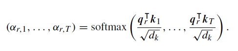

above equation is also called scalar dot product attention and is normalized to a probability score using softmax function. We get the self attention algorithm that was proposed in the Attention paper [3] 

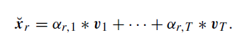

where 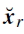 is the new contextual embedding

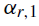 is the association score

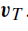 is the weighted average of the value vector 

the resulting embedding is a contextual embedding as it contains information about all words in the input text [17]

### example:

Sentence A: He got bit by Python. 

Sentence B: Python is my favorite programming language

plotting the attention relationships for the sentences we get 

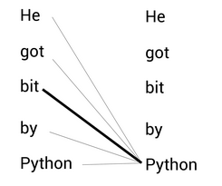   
Example 1

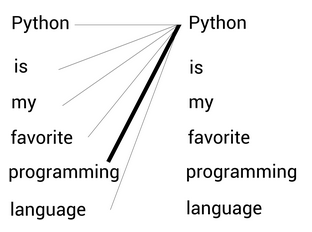

Example 2

BERT is able to discern dynamic embeddings based on context as opposed to context free models like word2Vec which generate static embeddings. This is due to the magic done by multi head attention mechanism. 

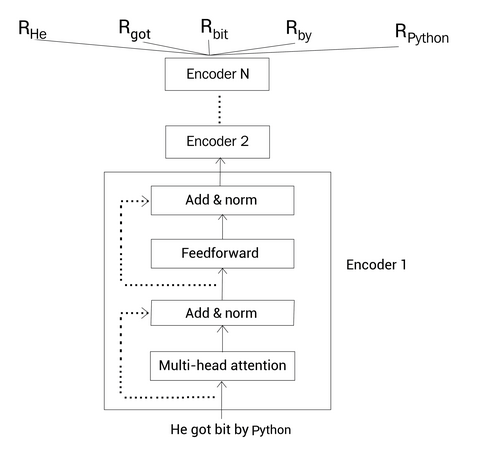
BERT generating the representation of each word in the sentence 

Difference between BERT versions like base and large are the number of layers of encoders. Base contains 12 layers whereas large contains 24. 


attention patterns in BERT [4]

[Visualizing BERT](https://colab.research.google.com/github/davidarps/2022_course_embeddings_and_transformers/blob/main/Visualizing_Attention_with_BertViz.ipynb#scrollTo=IAqLLQofc7IZ) 

BERT takes Input data as embeddings using the layers indicated below

1. Token Embedding
2. Segment Embedding
3. Position Embedding

Lets look at how tokens and embeddings affect the BERT process 

Sentence A: Paris is a beautiful city.

breaking up the above sentence into tokens we get 

`
tokens = [Paris, is, a, beautiful, city, I, love, Paris]
`

`
tokens = [ [CLS], Paris, is, a, beautiful, city, [SEP], I, love, Paris, [SEP]]
`

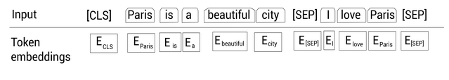

Token Embeddings

In order to make it easier for the Model to understand sentence starting and ending following tokens are added to the array. [CLS] is added at the beginning of the sentence whereas [SEP] are added at the end of every sentence to indicate end of every sentence. 

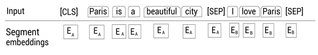

Segment Embeddings

Inorder to differentiate between sentences Segment embedding is done, EA in the above image relates to the first sentence whereas EB relates to the second sentence. 

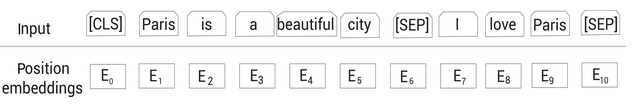

Position Embeddings

To preserve the word order in the input sentence we have to provide a way to tag the ordr of the words. Note that E0 applies to [CLS] token whereas E10 is [SEP] , this would be expected as they correspondingly start and stop the Input text.

Combining the above embeddings we get 


Final Embeddings 

BERT is an autoencoding language model which basically means that its able to read a given sentence left-to-right or right-to-left (Bidirectional) . During BERT training, a random 15% mask is applied on the words to train the network . Model reads the sentence in both directions and predicts the Masked word

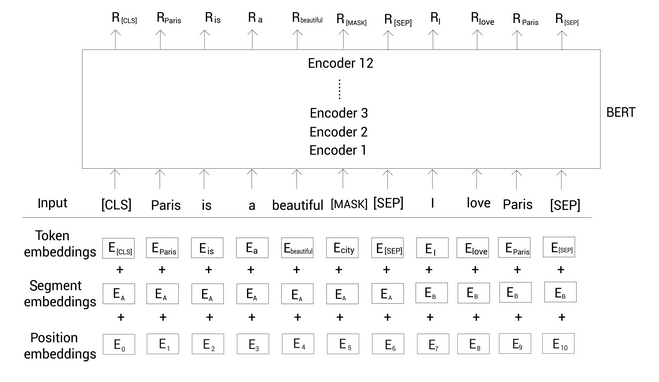

Notice that the word City has been masked as part of the training. To predict Masked token, we pass that as input to a Feedforward network with a softmax activation. Feedforward + softmax takes in the input tokens and gives out a probability of the words used in the vocabulary 

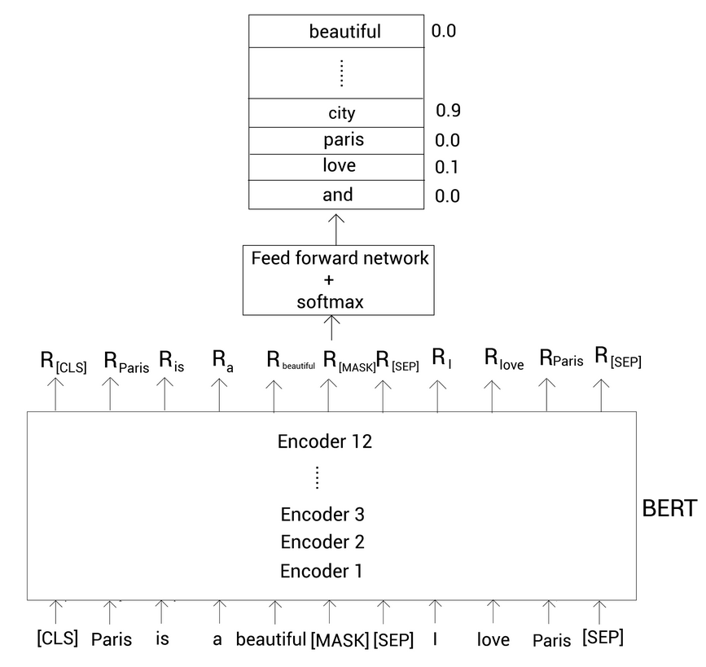

We observe that City is returned as the word with highest probability, which is the right answer

Two famouse BERT models are BERT base and BERT large , both can be found in hugging face 


## Finetuning BERT

pre-training a BERT model allows it to learn syntactic and semantic properties of the language. This can be used used for training tasks for subsequent fine tuning - this is called transfer learning as it allows the pretraining knowledge to be transfered to a related application [17]. Finetuning is done by classification solved by a logistic classifier L to the output embedding of the [CLS] token at position 1 of BERT's last encoder block [17]   

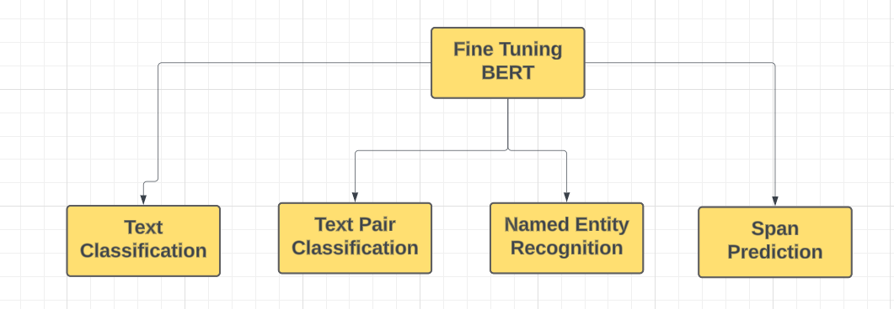
4 common finetuning tasks

1. Text Classification - classification of resturant reviews as positive or negative 
2. Text pair classification - This is used to establish relationship between consecutive sentences. 
3. Word Annotation or Named Entity Recognition (NER) annotating the tokens into clusters like location, persons, objects etc.
4. Span Prediction - this is to construct small sentences as response to a question and a pargraph of text which would contain the answer. 


# GPT Models

This section is about exploring GPT Models. Autoregressive language models (AR) or Generative Pre-Trained (GPT) models recieve a subsequence v1, v2, .... vn of input tokens and generate contextual embeddings for each token and use that to predict next token, thus predicting all the tokens in a sentence [17]. 

We will briefly look at the historical devleopment over the past decades and observe the technical evolution that kept adding to the innovations streak that eventually lead to the breakthroughs in LLMs 

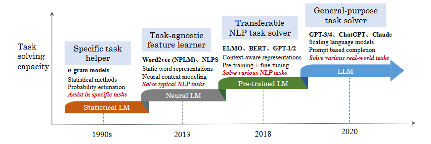
Evolution process of 4 generations of LMs. [6]

In the above image we see that Statistical LMs were getting investigated from the 90s. Initially were applied only for the relatively smaller tasks like spell-check as Models were limited to looking at only a single word.

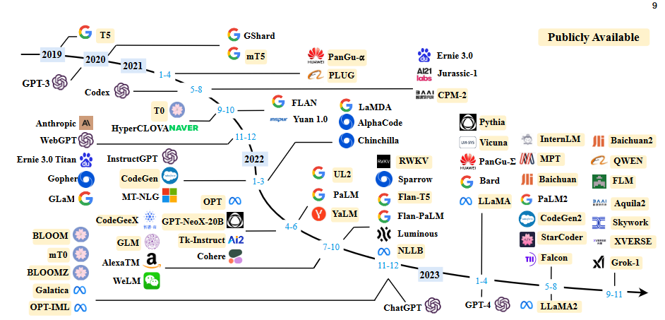
Timeline of LLMs. [6]

Above image is a zoomed out version of the timelines where publicly available LLMs were released. We observe the word soup of LLMs that are released from 2020 till 23 and the competitive landscape with many companies released thier own versions and making them available to the public. 

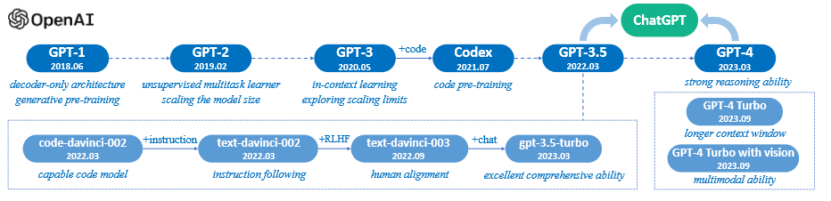
Chat GPT timelines. [6]

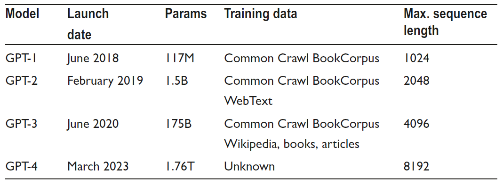
Chat GPT models and properties. [15]

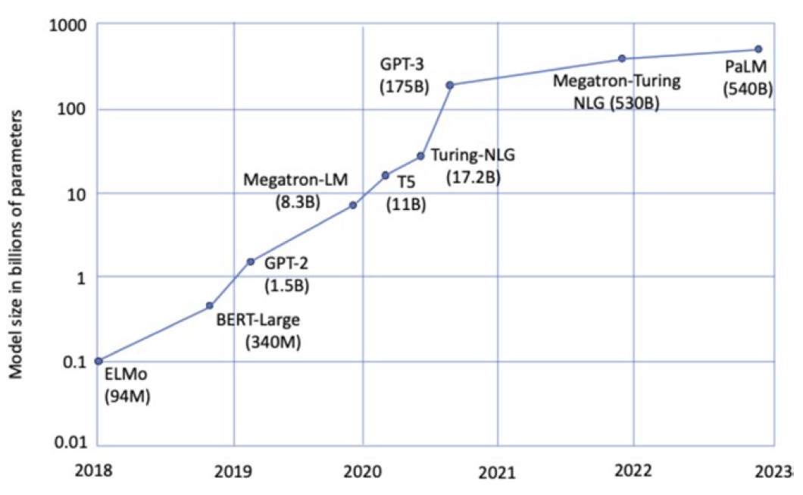
Increase in the number of Parameters. [15]

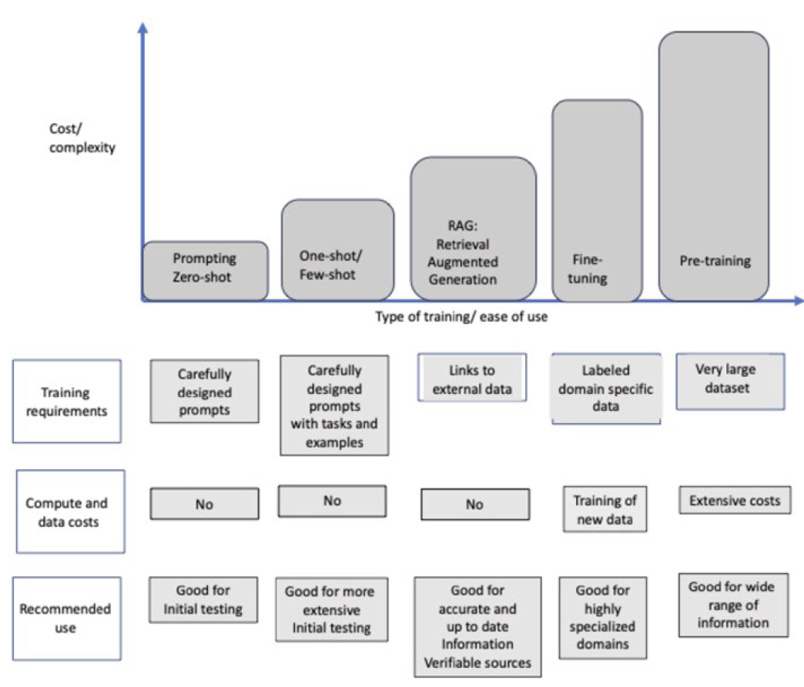
extending Pre Trained LLMs


# References

1. [BERT Paper](https://arxiv.org/pdf/1810.04805)

2. [Importance of Pre-training Compact Models](https://arxiv.org/pdf/1908.08962)

3. [What we know about How BERT works](https://arxiv.org/pdf/2002.12327)

4. [What does BERT look at](https://nlp.stanford.edu/pubs/clark2019what.pdf)

5. [Attention Paper](https://arxiv.org/pdf/1706.03762)

6. [Survey of Large Language Models](https://arxiv.org/pdf/2303.18223)

7. [GenAI Handbook](https://genai-handbook.github.io/)

8. [BERT Illustrated](https://jalammar.github.io/illustrated-bert/)

9. [GPT 2 Illustrated](https://jalammar.github.io/illustrated-gpt2/)

10. [GPT 3 Illustrated](https://jalammar.github.io/how-gpt3-works-visualizations-animations/)

11. [GPT Paper Link](https://cdn.openai.com/research-covers/language-unsupervised/language_understanding_paper.pdf)

12. [GPT 2 Paper Link](https://cdn.openai.com/better-language-models/language_models_are_unsupervised_multitask_learners.pdf)

13. [GPT 3 Paper Link](https://arxiv.org/pdf/2005.14165)

14. [GPT 4 Technical Report](https://arxiv.org/pdf/2303.08774)

15. Transforming Conversational AI, Apress 2023

16. [FT's Visual Explanation of LLMs](https://ig.ft.com/generative-ai/?xnpe_tifc=4fbXhF1jbD_7OkxX4.V7bjpJVdUZMds_Ou4.4FEN4fxdtfUN4.oA4FhshCJNbIQutI4sxD_Z4FeLbdoD4jXlxfQNhInZbdQLbDe_hfbd&utm_source=exponea&utm_campaign=B2B%20|%20One%20off%20|%20AI%20visual%20story%20promo%20|%20140923&utm_medium=email)

17. Foundation Models for Natural Language Processing, Springer 2023, Sven Gisselbach


