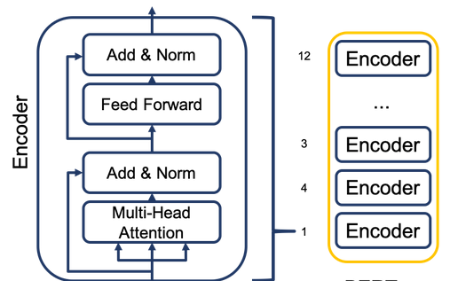
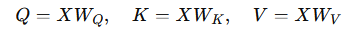
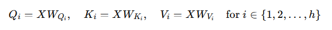
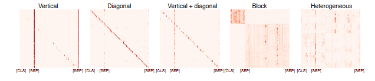
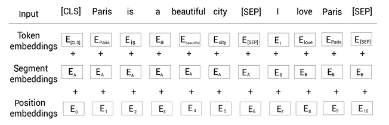
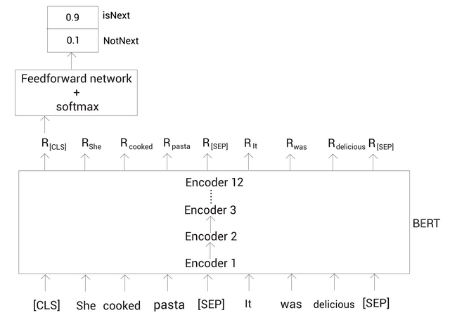
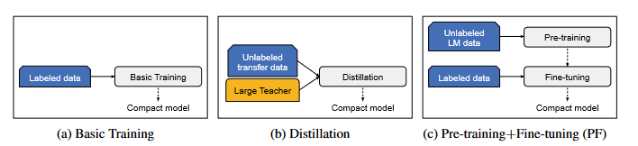
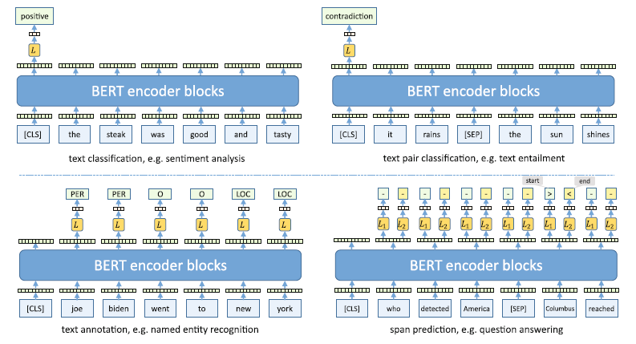

# Gen AI training

In this section we will be exploring BERT and GPT Model architectures. Before we dive into BERT lets look at the broader classification of models that are used in Natural Language Processing

1. Autoencoders 
2. Autoregressive language models
3. Transformers encoder - decoders

These models are usually pre-trained on a large general training set and often fine-tuned for a specific task, hence are called Pre-trained language Models (PLM). When the number of parameters of these models get large and can be instructed by prompts then they are called Foundation Models [17]. 

# BERT

Bidirectional Encoder Representation from Transformer (BERT) are autoencoders (AE) models that has revolutionised NLP with thier State-of-the-art embedding model published by Google. It has successfully completed many NLP tasks such as 

1. Question Answering
2. Text Generation
3. Sentence Classification
4. Text Summarization

Its success is largely due to its ability to do context-based embeddings, unlike context free embeddings like word2Vec

an oversimplified way to think of it would be 

`
Transformers - Decoders = BERT
`

### BERT Architecture

### Whats so Bidirectional about BERT ? 

Its able to read a given sentence left-to-right or right-to-left and is able to use the context learning that its got from digesting the input that its able to predict any word within that input sentence using the context.

### Why is it called Autoencorder ? 

Thats cause BERT requires only the encoder componenet of the Transformer duo. Output of a encoder layer is given as an input to another encoder layer and is propagated through the defined layers of BERT model.

## Tokens

The size of BERT vocabulary is 30K tokens. Input text is converted to Tokens by a specific kind of tokenizer like _Wordpiece_. What it does is that Common text like `dog` are assigned a token if they exist in the model vocabulary but if they are not present like `playing` then they are divided into `play` and `##ing` where the `##` gives the signal that its part of a word [17]. BERT also uses special tokens like 

`
[CLS] 
` - This is to signal the start of the Input sentence

`
[SEP]
` - This is to signal the end of Sentence

`
[MASK]
` - This is to signal the Masked word that BERT would need to predict

`
[PAD]
` - Spacer to increase length of tokens to keep all tokens consistent in length

## Attention

Self-attention, also known as intra-attention, is a mechanism within neural networks that allows the model to weigh the importance of different words in a sequence relative to each other. Self Attention is how BERT generates Contextual Embeddings . Each token is represented by a token embedding - which is a vector of fixed length. BERT takes in input embeddings xt for each input token vt
of input sequence v1,v2,...vt . Embeddings are transformed by linear mappings to query vectors Q, key vectors K, value Vectors V

Here, \( X \) is the input embedding, and \( W_Q \), \( W_K \), \( W_V \) are learnable weight matrices.

Multi-headed attention is an extension of the self-attention mechanism that allows the model to focus on different parts of the sequence from multiple perspectives or "heads" simultaneously. Each head operates independently, learning different aspects of the relationships between words.

association score between the tokens are computed by taking a scalar product between query vector and key vector

above equation is also called scalar dot product attention and is normalized to a probability score using softmax function. We get the self attention algorithm that was proposed in the Attention paper [3] 

where  is the new contextual embedding

 is the association score

 is the weighted average of the value vector 

the resulting embedding is a contextual embedding as it contains information about all words in the input text [17]

### example:

Sentence A: He got bit by Python. 

Sentence B: Python is my favorite programming language

plotting the attention relationships for the sentences we get 

   
Example 1

Example 2

BERT is able to discern dynamic embeddings based on context as opposed to context free models like word2Vec which generate static embeddings without taking context into account. This is due to the impact of multi head attention mechanism [18]. What multi head attention here means is that each word in the sentence is related to all the words and thereby a relationship is derived.  

BERT generating the representation of each word in the sentence. 

Here `RHe` implies representation of the word `He` also called _embedding_  

Difference between BERT versions like base and large are the number of layers of encoders. Base contains 12 layers whereas large contains 24. 

## Visualizing Attention

In the BERTology paper [4] authors look at the various ways in which attention affects the output result. Following is a illustration of the types of matrices that are constructed by the Model with Attention values. 

attention patterns in BERT [4]

A interactive way of dealing with attention can be done by the following notebook. The example in the notebook can be repalced with a custom example. The notebook demonstrates the many layers and heads that are used for a simple BERT version.

[Visualizing BERT](https://colab.research.google.com/github/davidarps/2022_course_embeddings_and_transformers/blob/main/Visualizing_Attention_with_BertViz.ipynb#scrollTo=IAqLLQofc7IZ) 

## Pre-Training

In the `Pretrained Students learn better` paper [2] the authors explore the impact of pretrainig on compact models. state-of-the-art models are expensive both in the cost and computational complexity sense. The authors explored a way to get the same gains that a large model would by pre-training compact models. 

BERT is pre-trained on two unsupervised tasks

1. Masked Language Modelling (MLM)
2. Next Sentence Prediction (NSP)

### MLM

For MLM tasks a given input sentence is masked with 15% of the words and trained with the network to predict masked words. To predict the Masked word, BERT reads the sentence in both directions and predicts the masked word. Lets look at an example

BERT takes Input data as embeddings, Embeddings are numerical vector arrays that words or tokens have been converted to, using the layers indicated below

1. Token Embedding
2. Segment Embedding
3. Position Embedding

Lets look at how tokens and embeddings affect the BERT process 

Sentence A: Paris is a beautiful city

Sentence B: I love Paris

Combining the above two sentences and breaking up them into tokens we get 

`
tokens = [Paris, is, a, beautiful, city, I, love, Paris]
`

`
tokens = [ [CLS], Paris, is, a, beautiful, city, [SEP], I, love, Paris, [SEP]]
`

Token Embeddings

In order to make it easier for the Model to understand sentence starting and ending following tokens are added to the array. [CLS] is added at the beginning of the sentence whereas [SEP] are added at the end of every sentence to indicate end of every sentence. 

Segment Embeddings

Inorder to differentiate between sentences Segment embedding is done, EA in the above image relates to the first sentence whereas EB relates to the second sentence. 

Position Embeddings

To preserve the word order in the input sentence we have to provide a way to tag the ordr of the words. Note that E0 applies to [CLS] token whereas E10 is [SEP] , this would be expected as they correspondingly start and stop the Input text.

Combining the above embeddings we get 

Final Embeddings 

BERT is an autoencoding language model which basically means that its able to read a given sentence left-to-right or right-to-left (Bidirectional) . During BERT training, a random 15% mask is applied on the words to train the network . Model reads the sentence in both directions and predicts the Masked word

Notice that the word City has been masked as part of the training. To predict Masked token, we pass that as input to a Feedforward network with a softmax activation. Feedforward + softmax takes in the input tokens and gives out a probability of the words used in the vocabulary 

We observe that City is returned as the word with highest probability, which is the right answer

Two famouse BERT models are BERT base and BERT large , both can be found in hugging face 

### Next Sentence Prediction

NSP is another strategy used for training. It is a binary classification task. The input given are two sentences and BERT has to predict the relationship between the two sentences. Following example helps us understand better

Sentence A: She cooked pasta.

Sentence B: It was delicious.

In the above example Sentence B is a follow up of A. Now consider 

Sentence A: Turn the radio on.

Sentence B: She bought a new hat. 

There is no relation between Sentence B and A

To visualize the above example we have the following image that has the input text sentences going through the 12 layer BERT base and is then passed over to the Feed Forward network and Softmax to predict the likely nature of Sentence B

## Finetuning BERT

pre-training a BERT model allows it to learn syntactic and semantic properties of the language. This can be used used for training tasks for subsequent fine tuning. 

Fine tuning allows the model to regress on smaller amount of data for a specific task which leads to better model in less data , less time. The entire model, including the pre-trained layers and the new task-specific layers, is trained on the labeled dataset. The weights are adjusted to optimize performance on the new task while retaining the language understanding learned during pre-training. Fine tuning also generally requires change in architecture like adding a new layer of logistic classifiers. The output of this exercise is that the skill learned can be transfered to similar problem types. This is called Transfer Learning. This ability is the main reason behind the fame for BERT type models. 

`Pre-training + Fine tuning = Transfer learing` 

4 common finetuning tasks

1. Text Classification - classification of resturant reviews as positive or negative 
2. Text pair classification - This is used to establish relationship between consecutive sentences. 
3. Word Annotation or Named Entity Recognition (NER) annotating the tokens into clusters like location, persons, objects etc.
4. Span Prediction - this is to construct small sentences as response to a question and a pargraph of text which would contain the answer. 

Here we notice that for text classification the example given is `The sandwich was good and tasty` and BERT classifies the sentiment as `Positive`.

Text pair classification (NSP) example given is `It rains` and `the sun shines` and BERT is able to classify it rightly as `contradiction`

For NER example we have `Joe Biden went to New York` and BERT is able to identify the parts of sentence as Person, Object and Location

For Span prediction the input question is `who discovered America` and the answer is identified as `Columbus` 

[Tiger Q&A Example](https://colab.research.google.com/drive/1GeWp-YmNha3ORYeyehR9UGLGYtYc14sM?usp=sharing)

### Many BERTs

as the field of NLP continues to evolve, various BERT-based models have been developed to address specific limitations, enhance performance, and optimize for different use cases.

| Model                                                                                             | Functionality                                                                                                                                            |
|---------------------------------------------------------------------------------------------------|---------------------------------------------------------------------------------------------------------------------------------------------------------|
| [ALBERT](https://arxiv.org/pdf/1909.11942.pdf)                                                    | A lite version of BERT that reduces model size by sharing parameters across layers and decomposing the embedding matrix.                                  |
| [RoBERTa: A Robustly Optimized BERT Pre-training Approach](https://arxiv.org/pdf/1907.11692.pdf)  | Enhances BERT by training with more data, larger batches, and longer sequences. Removes Next Sentence Prediction (NSP) task.                              |
| [ELECTRA: Pre-training Text Encoders as Discriminators Rather Than Generators](https://arxiv.org/pdf/2003.10555.pdf) | Uses a different approach by training a discriminator to distinguish between real and fake tokens created by a generator, making it more sample efficient. |
| [SpanBERT: Improving Pre-training by Representing and Predicting Spans](https://arxiv.org/pdf/1907.10529v3.pdf) | Focuses on span-level prediction tasks rather than token-level, improving performance on span-based tasks like question answering.                        |
| [Distilling the Knowledge in a Neural Network](https://arxiv.org/pdf/1503.02531.pdf)              | Introduces the concept of model distillation, where a smaller model (student) learns from a larger model (teacher).                                       |
| [DistilBERT: a distilled version of BERT: smaller, faster, cheaper and lighter](https://arxiv.org/pdf/1910.01108.pdf) | Distills BERT into a smaller, faster, and cheaper model that retains 97% of BERT's performance while being 60% faster.                                   |
| [TinyBERT: Distilling BERT for Natural Language Understanding](https://arxiv.org/pdf/1909.10351.pdf) | Further compresses BERT using a two-stage learning framework, aiming to achieve a smaller model with competitive performance.                            |
| [Distilling Task-Specific Knowledge from BERT into Simple Neural Networks](https://arxiv.org/pdf/1903.12136.pdf) | Focuses on task-specific distillation where BERT's knowledge for a specific task is distilled into a simpler neural network, improving efficiency.       |

# GPT Models

This section is about exploring GPT Models. Autoregressive language models (AR) or Generative Pre-Trained (GPT) models recieve a subsequence v1, v2, .... vn of input tokens and generate contextual embeddings for each token and use that to predict next token, thus predicting all the tokens in a sentence [17]. 

We will briefly look at the historical devleopment over the past decades and observe the technical evolution that kept adding to the innovations streak that eventually lead to the breakthroughs in LLMs 

Evolution process of 4 generations of LMs. [6]

In the above image we see that Statistical LMs were getting investigated from the 90s. Initially were applied only for the relatively smaller tasks like spell-check as Models were limited to looking at only a single word.

Timeline of LLMs. [6]

Above image is a zoomed out version of the timelines where publicly available LLMs were released. We observe the word soup of LLMs that are released from 2020 till 23 and the competitive landscape with many companies released thier own versions and making them available to the public. 

Chat GPT timelines. [6]

Chat GPT models and properties. [15]

Increase in the number of Parameters. [15]

extending Pre Trained LLMs

# References

1. [BERT Paper](https://arxiv.org/pdf/1810.04805)

2. [Importance of Pre-training Compact Models](https://arxiv.org/pdf/1908.08962)

3. [What we know about How BERT works](https://arxiv.org/pdf/2002.12327)

4. [What does BERT look at](https://nlp.stanford.edu/pubs/clark2019what.pdf)

5. [Attention Paper](https://arxiv.org/pdf/1706.03762)

6. [Survey of Large Language Models](https://arxiv.org/pdf/2303.18223)

7. [GenAI Handbook](https://genai-handbook.github.io/)

8. [BERT Illustrated](https://jalammar.github.io/illustrated-bert/)

9. [GPT 2 Illustrated](https://jalammar.github.io/illustrated-gpt2/)

10. [GPT 3 Illustrated](https://jalammar.github.io/how-gpt3-works-visualizations-animations/)

11. [GPT Paper Link](https://cdn.openai.com/research-covers/language-unsupervised/language_understanding_paper.pdf)

12. [GPT 2 Paper Link](https://cdn.openai.com/better-language-models/language_models_are_unsupervised_multitask_learners.pdf)

13. [GPT 3 Paper Link](https://arxiv.org/pdf/2005.14165)

14. [GPT 4 Technical Report](https://arxiv.org/pdf/2303.08774)

15. Transforming Conversational AI, Apress 2023

16. [FT's Visual Explanation of LLMs](https://ig.ft.com/generative-ai/?xnpe_tifc=4fbXhF1jbD_7OkxX4.V7bjpJVdUZMds_Ou4.4FEN4fxdtfUN4.oA4FhshCJNbIQutI4sxD_Z4FeLbdoD4jXlxfQNhInZbdQLbDe_hfbd&utm_source=exponea&utm_campaign=B2B%20|%20One%20off%20|%20AI%20visual%20story%20promo%20|%20140923&utm_medium=email)

17. Foundation Models for Natural Language Processing, Springer 2023, Sven Gisselbach

18. Getting Started with Google BERT , Packt Publishing, Sudharshan Ravichandran 2023

19. [ALBERT: A Lite BERT for Self-supervised Learning of Language Representations](https://arxiv.org/pdf/1909.11942.pdf)

20. [RoBERTa: A Robustly Optimized BERT Pre-training Approach](https://arxiv.org/pdf/1907.11692.pdf)

21. [ELECTRA: Pre-training Text Encoders as Discriminators Rather Than Generators](https://arxiv.org/pdf/2003.10555.pdf)

22. [SpanBERT: Improving Pre-training by Representing and Predicting Spans](https://arxiv.org/pdf/1907.10529v3.pdf)

23. [Distilling the Knowledge in a Neural Network](https://arxiv.org/pdf/1503.02531.pdf)

24. [DistilBERT, a distilled version of BERT: smaller, faster, cheaper and lighter](https://arxiv.org/pdf/1910.01108.pdf)

25. [TinyBERT: Distilling BERT for Natural Language Understanding](https://arxiv.org/pdf/1909.10351.pdf)

26. [Distilling Task-Specific Knowledge from BERT into Simple Neural Networks](https://arxiv.org/pdf/1903.12136.pdf)

27. [Transformer Explainer](https://poloclub.github.io/transformer-explainer/)

28. [BERT compendium](https://huggingface.co/docs/transformers/model_doc/bert)
